# Top 12 Business Finance Platforms Ranked in 2025 (Latest Compilation)

Running a company feels like trying to juggle fire while riding a unicycle sometimes. Between tracking expenses from five different corporate cards, paying vendors in seven currencies, and trying to make your monthly close happen before the next quarter starts, something's gotta give.

The platforms here aren't magic wands, but they do cut through the noise. From multi-currency accounts that stop bleeding money on FX fees to spend management tools that actually remember to chase receipts for you, these are the solutions helping modern businesses move faster without hemorrhaging cash on financial busywork.

## **[Aspire](https://aspireapp.com)**

All-in-one financial operating system built for businesses scaling across Asia-Pacific and beyond.

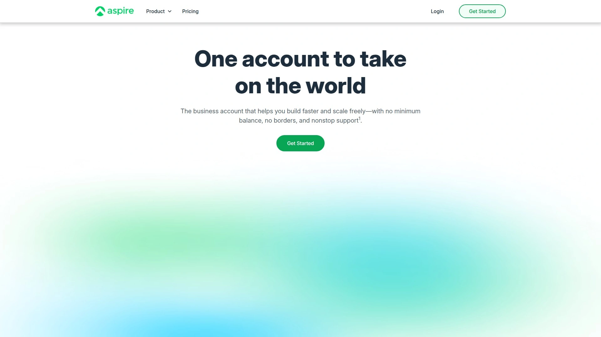

Aspire brings together everything a growing company needs to manage global operations from a single dashboard. You get multi-currency business accounts that let you hold and transact in major currencies without forcing unnecessary conversions. Their corporate cards come with granular spending controls, so you can issue cards to team members with preset limits and category restrictions that actually stick.

The platform's FX rates are notably competitive, helping businesses keep more margin when paying overseas suppliers or collecting from international clients. Real-time expense tracking means your finance team isn't drowning in receipt chasing three weeks after month-end. Aspire also handles bill payments and integrates smoothly with accounting systems like Xero and QuickBooks.

What makes it particularly valuable for mid-sized companies is the yield feature—your idle funds can earn returns without getting locked away. Most businesses keep working capital sitting in checking accounts earning nothing, but Aspire lets you generate income on those funds while maintaining next-business-day access when you need it.

The platform scales well from startups to enterprise clients, with dedicated account management for larger operations. If you're running a business with international suppliers, remote teams, or customers across multiple countries, Aspire handles the complexity without requiring you to piece together five different tools.

## **[Ramp](https://ramp.com)**

AI-powered spend management platform that helps companies actively reduce expenses through automation and insights.

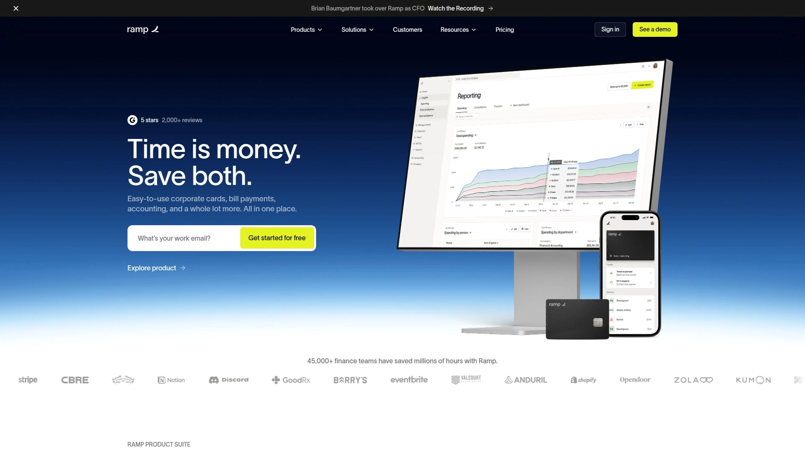

Ramp takes a different approach than most corporate card providers—instead of trying to get you to spend more so they earn interchange fees, they actually help you spend less. Their AI engine constantly analyzes your spending patterns and flags opportunities to save money, whether that's spotting duplicate subscriptions, alerting you to overpriced vendors, or negotiating better rates on your behalf.

The corporate cards themselves come with 1.5% cash back and integrate directly into their expense management system. Receipt matching happens automatically, expense reports practically build themselves, and the mobile app makes it dead simple for employees to snap photos and move on with their day.

What sets Ramp apart is the real-time policy enforcement. Rather than catching violations after the fact, spending limits and approval workflows are baked directly into the cards. An employee can't blow through their budget because the card simply won't let them. This prevents awkward conversations and removes the manual review burden from finance teams.

The platform connects seamlessly with major accounting systems including QuickBooks, Xero, NetSuite, and Sage Intacct. There's also a free tier that includes unlimited cards, expense management, and bill pay—no monthly fees or user charges. For companies prioritizing efficiency and cost control over flashy perks, Ramp delivers serious operational value.

## **[Brex](https://www.brex.com)**

Global corporate card and spend platform built specifically for venture-backed startups and scaling enterprises.

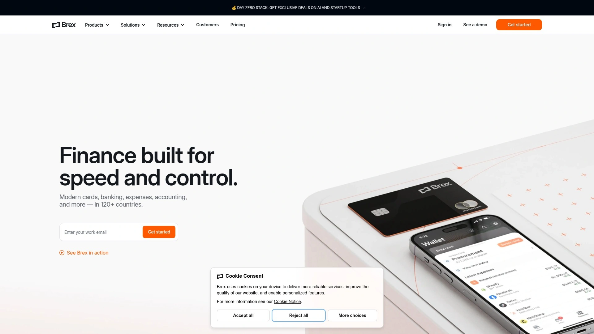

Brex made its name by offering startup-friendly corporate cards that don't require personal guarantees from founders. Instead of evaluating your personal credit score, they look at your company's cash position and revenue to determine credit limits, which can be 10-20x higher than traditional cards.

The platform has evolved into a comprehensive financial operations tool combining corporate cards, business accounts, expense management, travel booking, and bill pay. You can issue unlimited virtual and physical cards with precise spend controls down to individual merchant categories. International operations are well-supported with cards in local currencies and competitive FX rates.

Business accounts through Brex offer same-day liquidity, fast global payments, and up to $6M in FDIC insurance through partner banks. Their yield product lets you earn returns on idle cash—currently offering competitive rates on USD and other currencies.

The rewards program is particularly interesting for tech companies, with options including cash back, travel points, or even unique perks like company offsites and executive coaching. Integration capabilities are extensive, connecting with NetSuite, QuickBooks, Xero, Sage Intacct, and most major HRIS platforms.

For funded startups and mid-market companies with global ambitions, Brex handles the complexity of multi-entity operations, international payments, and travel management in a single system. The platform has become increasingly focused on the venture ecosystem, so it's most valuable for companies with substantial cash reserves or regular funding rounds.

## **[Airwallex](https://www.airwallex.com)**

Complete financial infrastructure for businesses operating across borders with multi-currency accounts and payment rails.

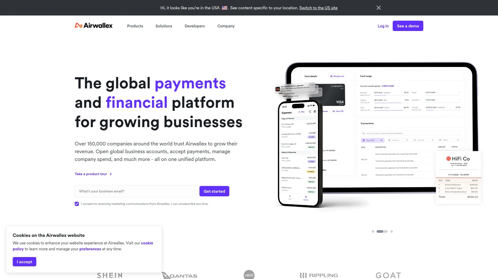

Airwallex started as an API-first payment platform and has grown into a full financial operating system for companies doing business internationally. At its core, you get business accounts in 23+ currencies with the ability to collect payments locally in 150+ countries. This means your customers in Europe can pay you in euros to a local account, your clients in Australia pay in AUD, and you're not forcing everyone through expensive cross-border wires.

The FX rates are competitive, typically featuring a 0.5-1% markup over mid-market rates—significantly better than traditional banks. Corporate cards come in both physical and virtual forms with zero foreign transaction fees, making them genuinely useful for distributed teams spending in multiple currencies.

Spend management features rival dedicated platforms, with real-time visibility, customizable approval workflows, and automated expense categorization. The platform handles bill payments, payroll processing for international contractors, and even online payment acceptance if you're running an e-commerce operation.

Integration depth is strong, connecting with Shopify, WooCommerce, Xero, QuickBooks, NetSuite, and HubSpot. For businesses with complex international operations—think multiple subsidiaries, regional offices, or supply chains spanning several countries—Airwallex provides the infrastructure to manage it all without duct-taping together a bunch of different tools.

## **[Wise Business](https://wise.com/business)**

Transparent multi-currency account focused on international payments with the real mid-market exchange rate.

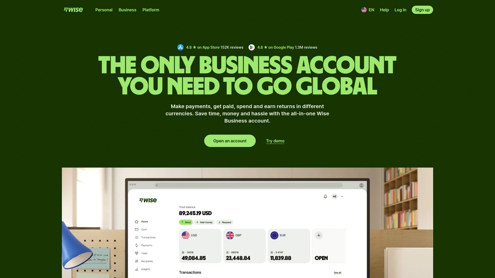

Wise built its reputation on radical transparency. Rather than hiding fees in exchange rate markups, they show you exactly what you're paying and use the real mid-market rate you'd see on Google or Reuters. For a company sending $10,000 overseas, this difference adds up fast compared to traditional banks that typically mark up rates by 3-5%.

The multi-currency account lets you hold and manage money in 40+ currencies from one dashboard. You get local account details in major markets, so international clients can pay you as if you're a domestic company. This speeds up receipt of funds and often reduces fees on their end too.

The platform is straightforward—there's no fancy AI analysis or procurement tools. It does one thing extremely well: moving money across borders cheaply and transparently. Batch payments let you pay dozens of suppliers at once, and the direct debit feature handles recurring payments automatically.

Wise integrates cleanly with QuickBooks and Xero for accounting sync. The mobile app works well for teams on the move. For freelancers, agencies, and small businesses that primarily need reliable international payments without a lot of bells and whistles, Wise delivers exceptional value. The one-time £45 setup fee is refreshingly honest compared to platforms that advertise as "free" but make money through hidden rate markups.

## **[Expensify](https://www.expensify.com)**

Mobile-first expense management platform with SmartScan receipt capture and quick reimbursements.

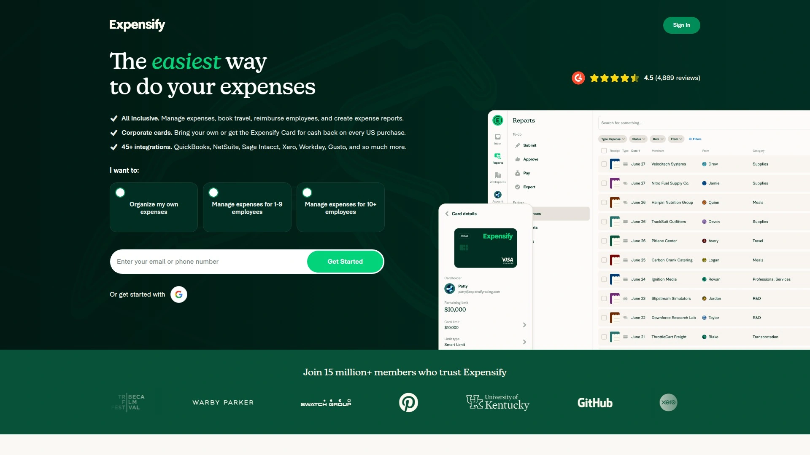

Expensify focuses relentlessly on making expense reporting painless for employees and fast for finance teams. The SmartScan feature uses OCR to read receipts automatically—employees snap a photo, and the system extracts merchant name, amount, date, and category without manual typing. It's surprisingly accurate and saves real time.

The platform offers both software-only and card-integrated options. With the Expensify Card, transactions automatically generate expense entries and offer 2% cash back. The catch is you need to use it for at least half your monthly spend to get the full discount on your Expensify subscription. Cards work internationally, though foreign transaction fees apply.

Approval workflows are simple to configure, and next-day reimbursements keep employees happy. The mobile experience is polished—probably the best among expense management apps. Integration with QuickBooks, Xero, NetSuite, and major travel booking systems means data flows smoothly without duplicate entry.

Pricing runs higher than some alternatives, ranging from $5-36 per active user monthly depending on plan and usage. The platform shines for teams that travel frequently and need dead-simple receipt capture. It's less compelling if you need sophisticated spend controls or bill payment automation, where dedicated procurement platforms offer more depth.

## **[BILL Spend & Expense](https://www.bill.com)**

Spend management combining corporate cards with automated bill pay and accounts payable workflows.

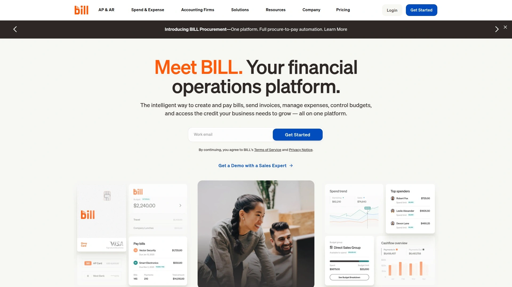

BILL Spend & Expense came out of the Divvy acquisition and tightly integrates expense tracking with the broader BILL ecosystem for AP and AR. You get corporate cards with real-time spend controls and automated expense categorization. Virtual cards can be created instantly for specific vendors or one-time purchases, limiting exposure.

The bill pay functionality is particularly strong—invoices can be processed through email, approvals route automatically, and payments go out via ACH, wire, or check. If you're already using BILL for accounts payable, the integration is seamless. The platform syncs with QuickBooks, Xero, NetSuite, and Sage Intacct.

Credit limits range from $500 to $5M depending on your business profile, and there's a free plan covering basic expense management and card access. The interface is clean and intuitive, making onboarding straightforward even for non-finance team members.

Where BILL excels is for SMBs that need both expense tracking and vendor payment management but don't want to juggle multiple platforms. The approval workflows are flexible without being overly complex. It's a solid middle-ground option for companies that have outgrown basic expense tracking but aren't ready for enterprise-grade procurement systems.

## **[Navan](https://navan.com)**

Travel and expense management platform combining booking, corporate cards, and spend tracking in one system.

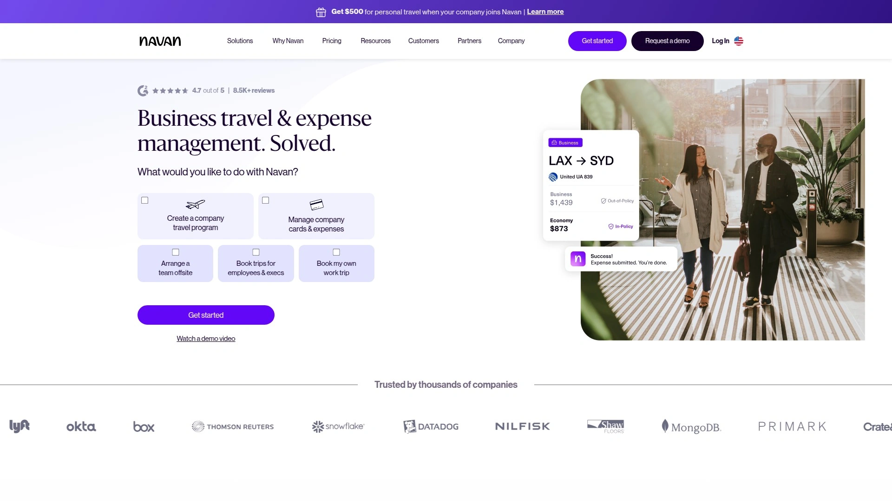

Navan built its platform around business travel, then expanded into comprehensive expense management. The travel booking experience is genuinely good—finding flights and hotels feels more like consumer apps than clunky corporate tools. The AI assistant provides recommendations based on company policy, past preferences, and loyalty programs.

Corporate cards integrate directly with travel bookings, so expenses from your trip automatically match with itineraries. No more hunting for receipts from that late-night Uber or airport meal. The platform handles multi-currency transactions cleanly and offers same-day reimbursements in 45 countries.

Spend controls can be configured by employee, department, or trip. Compliance alerts happen in real-time rather than during reconciliation three weeks later. Mobile functionality is strong—employees can book, modify trips, and submit expenses entirely from their phone.

Pricing is customized based on company size and needs, with options to use Navan cards or integrate existing corporate cards. For companies where employees travel regularly, the combined travel and expense management removes significant friction. Finance teams get real-time visibility into spending, and travelers get a booking experience that doesn't make them want to expense their therapy bills.

## **[Mercury](https://mercury.com)**

Modern business banking built for startups with integrated treasury, bill pay, and expense management.

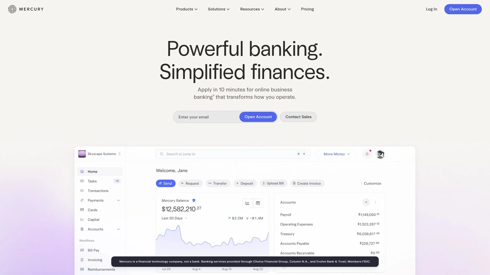

Mercury offers what traditional business banking should have been—fast account opening, no monthly fees, clean interface, great mobile app. It's become the default choice for many early-stage startups, particularly after the Silicon Valley Bank collapse drove founders to diversify banking relationships.

The platform provides FDIC-insured checking accounts with features startups actually use: multiple sub-accounts for clean bookkeeping, treasury products earning competitive yields on idle cash, instant virtual and physical debit cards. Bill pay is built in, with automated invoice processing and approval workflows.

Expense management is simpler than dedicated platforms but covers the basics well—receipt capture, categorization, and integration with QuickBooks. Mercury isn't trying to be everything; it focuses on core banking done exceptionally well. The team behind it clearly uses the product themselves.

No minimum balance requirements, no monthly fees, no overdraft charges. Mercury makes money through interest on deposits and interchange fees. For early-stage companies that need reliable banking more than sophisticated spend management, Mercury nails the fundamentals. As companies scale and need more advanced finance operations, they often graduate to platforms with deeper procurement and global payment capabilities.

## **[Rippling Spend](https://www.rippling.com/spend)**

Unified platform connecting expense management with HR and payroll data for policy automation.

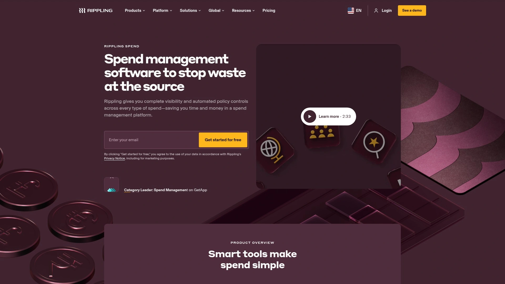

Rippling Spend differentiates itself through integration with employee data from Rippling's HR and payroll systems. This connection enables genuinely smart automation—policies adjust automatically based on role changes, geographic location, or department. When someone gets promoted to manager, their per diem increases without manual intervention.

Corporate cards can be issued instantly based on employee attributes, with spending limits that update dynamically. Approval routing finds the right person every time because the system knows your org chart. Expenses convert automatically between currencies based on where employees are located, simplifying international reconciliation.

The expense submission experience is straightforward—snap receipt photo, system categorizes automatically, done. Transactions match with receipts without manual hunting. Real-time reporting gives finance teams visibility into spending trends before month-end surprises.

The platform's value scales with team size and complexity. For companies under 50 people, standalone solutions like Ramp or BILL might offer better value. But for growing companies already using Rippling for HR and payroll, adding Spend creates meaningful efficiency gains through data leverage. Policies become enforceable rather than just guidelines, and finance teams stop manually cross-referencing employee info from three different systems.

## **[Zoho Expense](https://www.zoho.com/expense)**

Affordable expense management with deep customization and tight Zoho ecosystem integration.

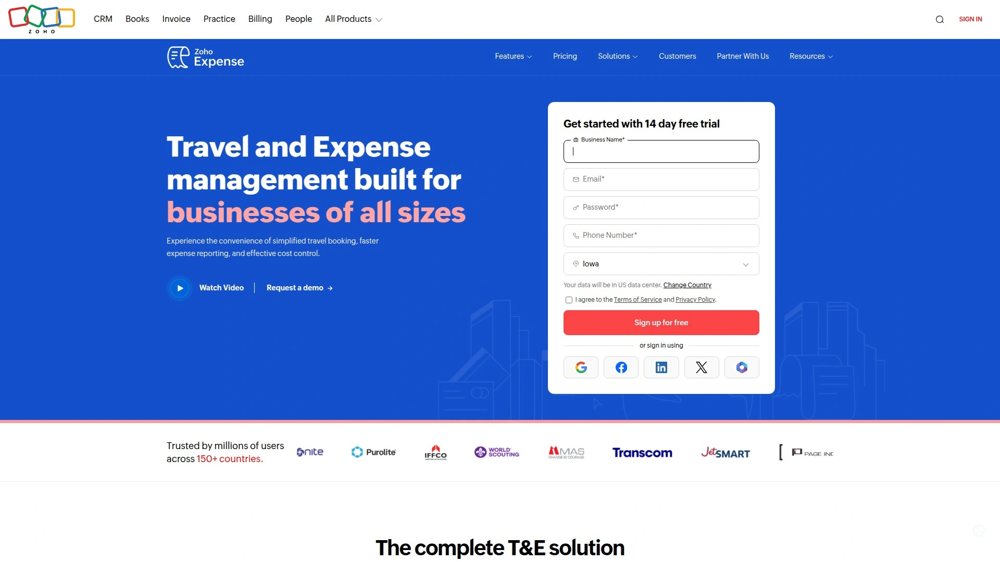

Zoho Expense offers comprehensive expense tracking at prices that won't make CFOs wince. The Standard plan runs $4 per user monthly, and there's even a free tier for tiny teams. Despite the low cost, feature depth is impressive—automated receipt scanning, multi-level approval workflows, mileage tracking, per diem management, and credit card reconciliation.

The real win comes if you're already in the Zoho ecosystem. Expense integrates tightly with Zoho Books for accounting, Zoho People for HR, and other Zoho applications. This creates a connected workflow without paying integration fees to third parties.

Customization options are extensive—you can modify fields, workflows, reports, and dashboards to match how your team actually works rather than forcing your processes into rigid templates. The platform handles multiple currencies and includes tax compliance features for various regions.

The interface isn't as polished as newer fintech darlings, but it's functional and the mobile app works reliably. For budget-conscious companies, consultancies, or businesses already committed to Zoho's broader software suite, Expense delivers solid value. It's particularly strong for companies with complex approval hierarchies or unusual expense categories that need custom handling.

## **[SAP Concur](https://www.concur.com)**

Enterprise-grade travel and expense platform for large organizations with complex global operations.

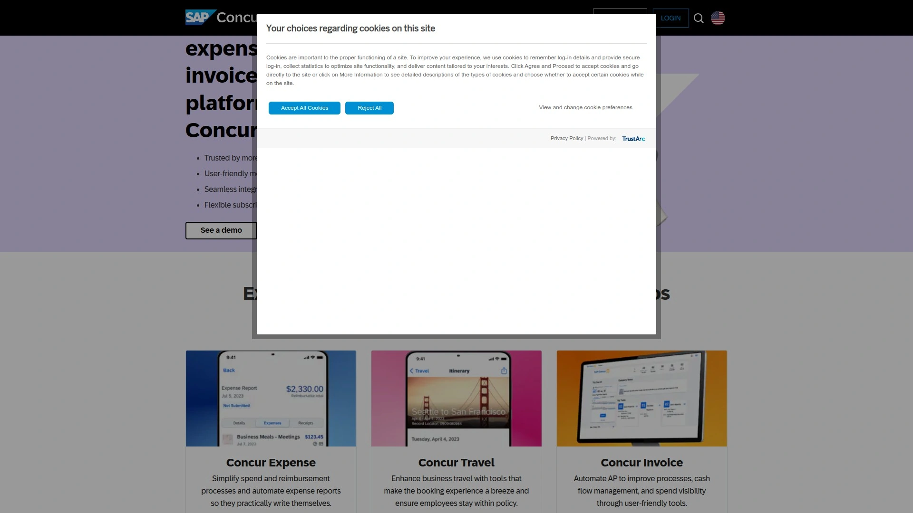

SAP Concur dominates the enterprise expense management space for a reason—it handles the complexity that large organizations can't avoid. Multi-entity accounting across dozens of countries, compliance with local tax regulations in 35 different jurisdictions, integration with massive ERP systems, and approval workflows that span multiple business units.

The platform combines travel booking with expense management, giving companies centralized control over both. Receipt capture works through email, mobile app, or direct feeds from corporate cards. Automatic policy checking flags violations before submission rather than during audit.

Integration capabilities are extensive—Concur connects with virtually every major ERP, accounting system, HRIS platform, and travel supplier. For companies running SAP or Oracle in the backend, integration is particularly seamless.

The downside is complexity and cost. Implementation takes months, not days. Pricing isn't transparent—you'll need custom quotes. The interface feels more corporate than modern fintech tools. For mid-sized companies, simpler platforms likely make more sense.

But for global enterprises with thousands of employees, complex entity structures, and stringent compliance requirements, Concur handles scenarios that would break lighter-weight tools. It's not sexy, but it works at scale.

---

## FAQ

**Which platform works best for companies operating internationally?**

Airwallex and Aspire both excel at international operations, offering multi-currency accounts, local collection capabilities, and competitive FX rates. Airwallex has broader geographic coverage with accounts in 23+ currencies, while Aspire provides stronger integration with Asia-Pacific markets. Wise remains the budget option for straightforward international transfers using real mid-market rates.

**Can I use these platforms without switching my existing corporate cards?**

Some platforms require their own cards to access full functionality—Brex, Ramp, and BILL Spend & Expense are card-first solutions. However, Rippling Spend, Zoho Expense, and Expensify can work with existing bank cards through real-time feeds or manual reconciliation. This flexibility matters if you have established credit lines you want to preserve.

**What's the typical implementation timeline for these systems?**

Lighter platforms like Ramp, Mercury, and Wise can be operational within days—sometimes hours. Mid-complexity solutions like Aspire, Airwallex, and Navan typically take 1-2 weeks for full onboarding. Enterprise platforms like SAP Concur often require 3-6 months for proper implementation across large organizations with complex requirements.

---

## Conclusion

The financial tools your company uses shouldn't slow you down. Whether you're wrestling with international payments, trying to stop expense reports from consuming entire afternoons, or just want cards that won't randomly decline when an employee tries to buy lunch in Berlin, the right platform makes everything flow more naturally.

[Aspire](https://aspireapp.com) stands out for businesses scaling across multiple markets—the multi-currency accounts and competitive FX rates eliminate the constant friction of cross-border operations, while the yield feature ensures your working capital isn't just sitting idle. For companies caught between managing local teams and serving global customers, it cuts through complexity without requiring you to become a treasury expert.
